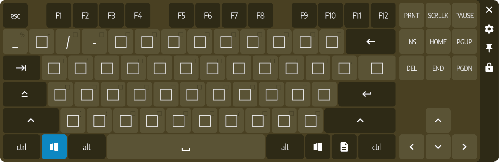
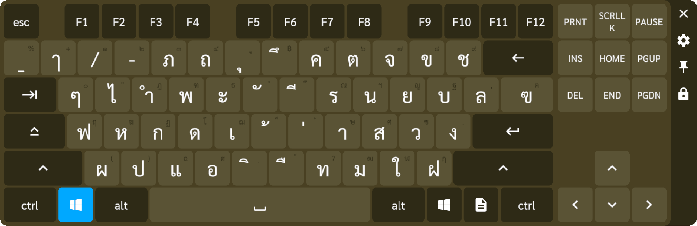



 
  # XSOverlay Font Changer
  ### Change the [XSOverlay](https://store.steampowered.com/app/1173510/XSOverlay/) font to your own lovely one
  

## 🛠️ Features
- Support Keyboard Unity font patching
- Support WebView overlay CSS font patching
- Support [xsoverlay-keyboard-osc](https://github.com/nyakowint/xsoverlay-keyboard-osc) custom input bar and WebView css font patching

## 🖥️ Screenshot
   

## ⛏️ Installation
1. [Follow the BepInEx install guide](https://github.com/BepInEx/BepInEx/wiki/Installation) for [Steam]/steamapps/common/[XSOverlay].
2. Download the plugin ZIP from [Releases](https://github.com/chaixshot/xsoverlay-font-changer/releases/latest)
3. Extract the ZIP file and move folders inside ``xsoverlay-font-changer`` to ``[XSOverlay]/BepInEx``
4. You can change your lovely font in ``[XSOverlay]/BepInEx/config/xsoverlay.font.changer.cfg`` file with Notepad
5. Start XSOverlay and enjoy!

## ⛔ Disable
Go to `[Steam]/steamapps/common/[XSOverlay]/BepInEx/plugins/``, remove **xsoverlay_font_changer.dll**

## 🗑️ Uninstall
Go to ``[Steam]/steamapps/common/[XSOverlay]``, remove **BepInEx**, **doorstop_config.ini**, **winhttp.dll**
