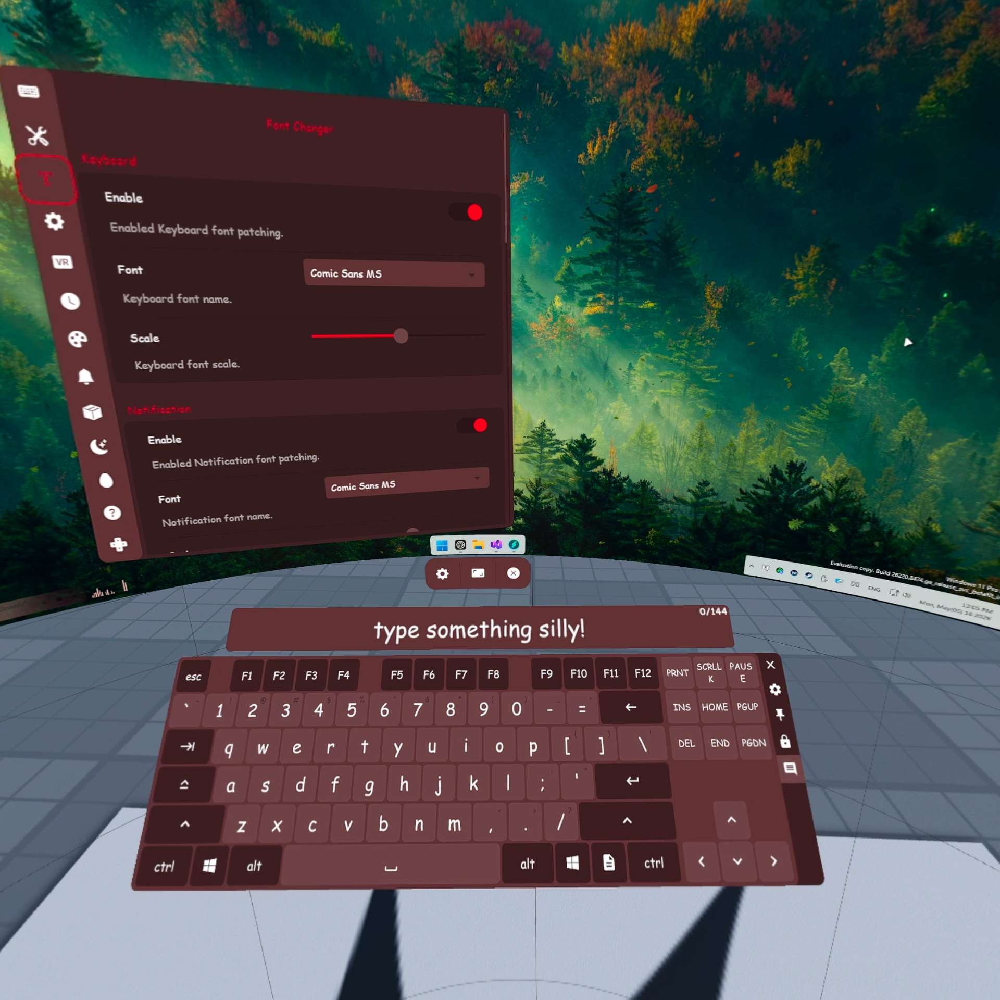
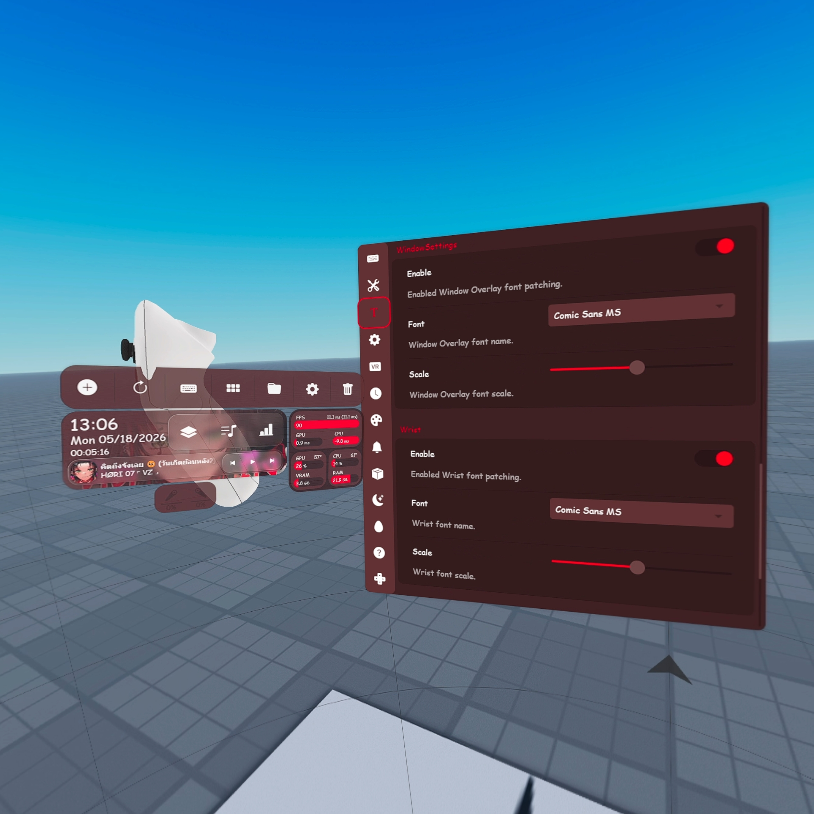
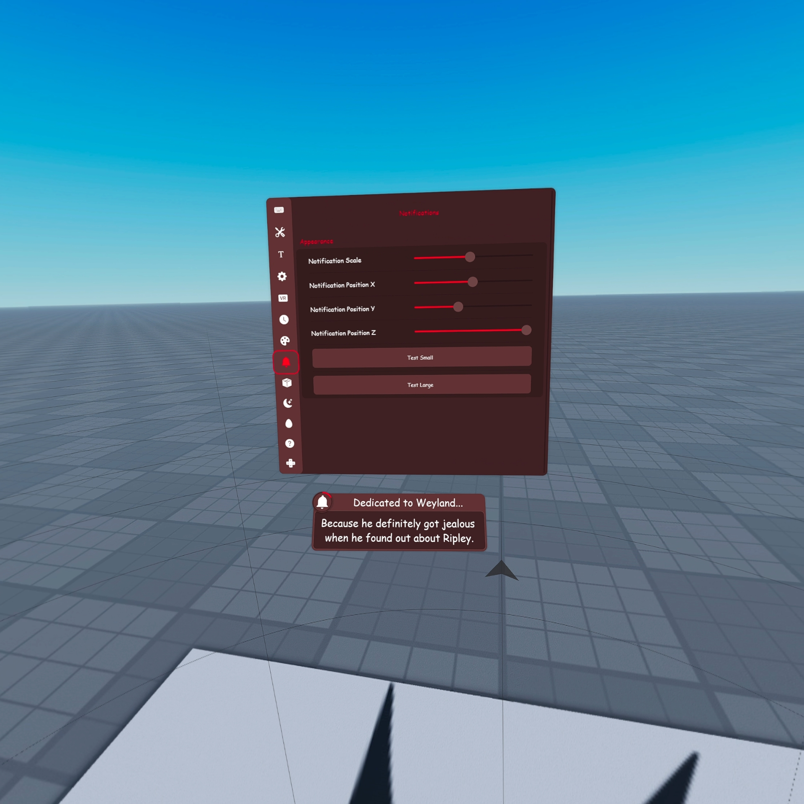



  # XSOverlay Font Changer
  ### Change the [XSOverlay](https://store.steampowered.com/app/1173510/XSOverlay/) font to your own lovely one
  
  

## 🛠️ Features
- Using a Windows pre-installed font
- Change font setting in the XSOverlay settings menu
- Support changing at runtime
- Support Keyboard font patching
- Support WebView overlay CSS (Wrist, Setting, Notification) font patching
- Compatible with [xsoverlay-keyboard-osc](https://github.com/nyakowint/xsoverlay-keyboard-osc) custom input canvas

## 🖥️ Screenshot
  

## ⛏️ Installation
1. Download the plugin ZIP from [Releases](https://github.com/chaixshot/xsoverlay-font-changer/releases/latest)
2. Extract the ZIP and drop the files and folders inside ``xsoverlay-font-changer`` to ``[Steam]/steamapps/common/[XSOverlay]``
3. Launch XSOverlay.
4. Enjoy!

## ⚙️ Configuration

This mod injects a custom settings page directly into the XSOverlay UI.

1. Open the XSOverlay **Settings** menu.
2. Click on the **Font Changer** (T icon) tab in the sidebar.
3. Adjust settings in real-time.

## ⛔ Disable
Go to ``[Steam]/steamapps/common/[XSOverlay]/BepInEx/plugins/`` and remove ``xsoverlay_font_changer.dll``

## 🗑️ Uninstall
Go to ``[Steam]/steamapps/common/[XSOverlay]`` and remove ``BepInEx``, ``doorstop_config.ini``, ``winhttp.dll``

## Credits
- **[XSOverlay](https://store.steampowered.com/app/1173510/XSOverlay/):** The original application by XiS.
- **[BepInEx](https://github.com/bepinex/bepinex):** For the plugin framework.
