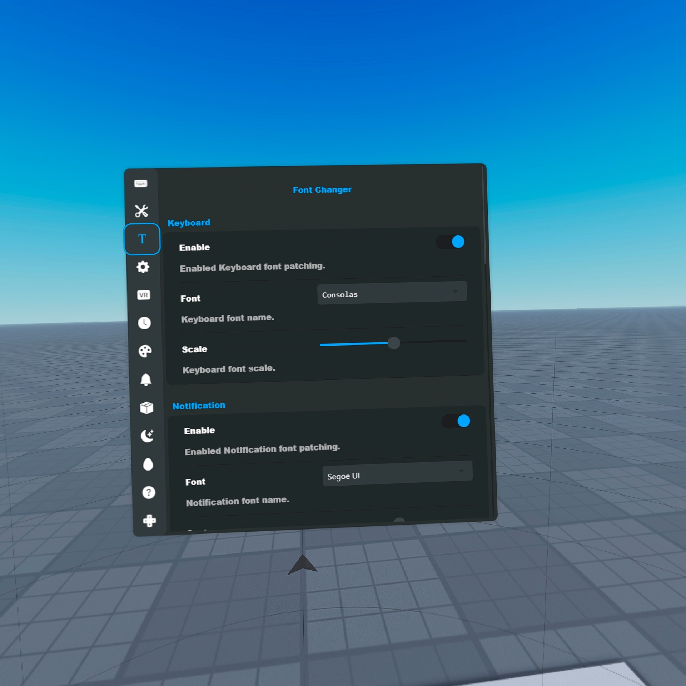
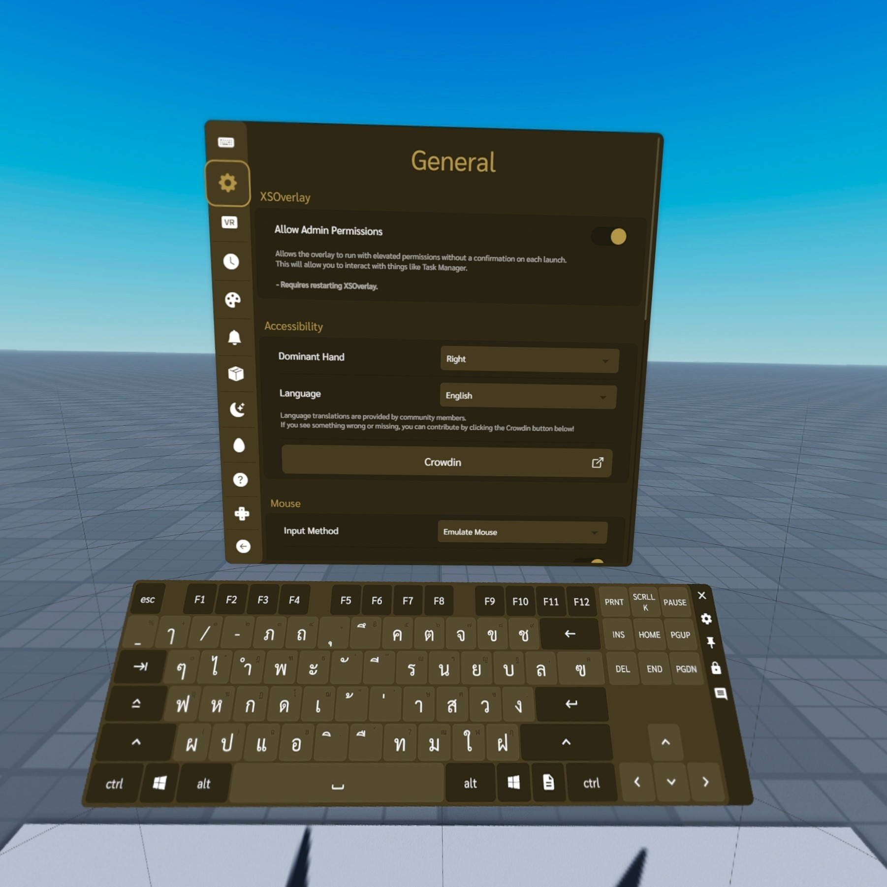



 
  # XSOverlay Font Changer
  ### Change the [XSOverlay](https://store.steampowered.com/app/1173510/XSOverlay/) font to your own lovely one
  

## 🖥️ Desktop screenshot
 

## ⛏️ Installation
1. [Follow the BepInEx install guide](https://github.com/BepInEx/BepInEx/wiki/Installation) for XSOverlay.
2. Download the plugin ZIP from [Releases](https://github.com/chaixshot/xsoverlay-font-changer/releases/latest)
3. Extract the ZIP file and move ``xsoverlay-font-changer`` from the release to ``[XSOverlay]/BepInEx``
4. You can change your lovely in ``[XSOverlay]/BepInEx/config/xsoverlay.font.changer.cfg`` file with Notepad
5. Start XSOverlay

## ⛔ Disable
Go to ``[XSOverlay]/BepInEx/plugins/``, remove **xsoverlay_font_changer.dll**
